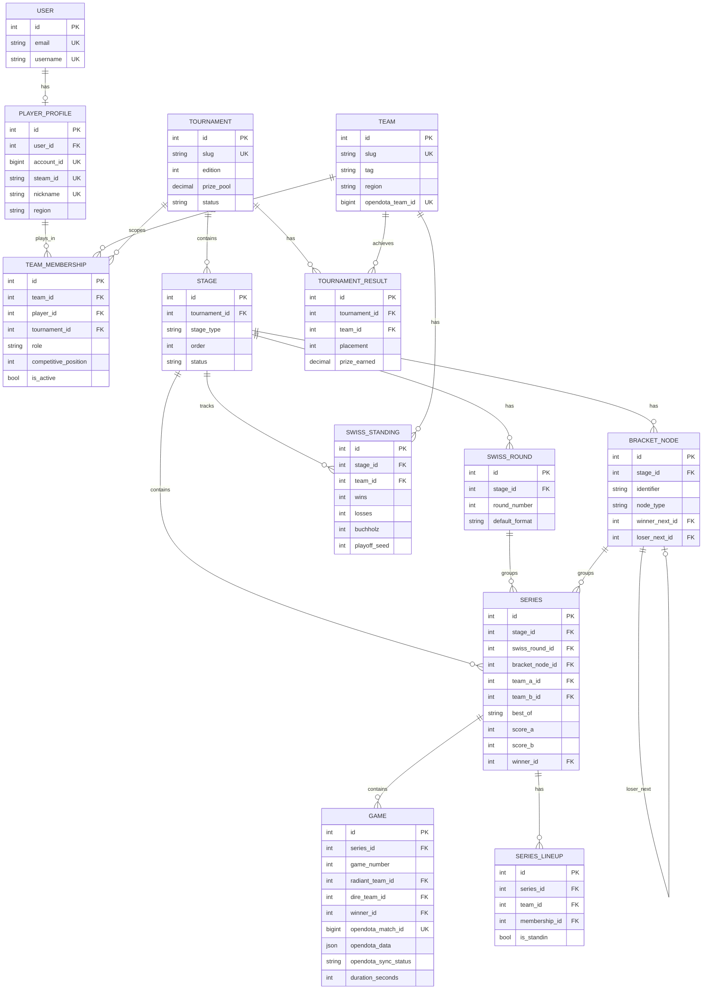

# Architecture — El Gran Coliseo de Benjaz
> Django + PostgreSQL + DRF + OpenDota Integration

---

## 1. Executive Summary

Plataforma de torneos Dota 2 con formato Swiss Stage (16 equipos) → Playoffs (Single Elimination). Tres responsabilidades:

1. **Gestión organizativa**: torneos, equipos, rosters, series, brackets, standings.
2. **Presentación pública**: resultados en tiempo real.
3. **Integración OpenDota**: snapshot JSON de partidas sin replicar su schema.

**Principio central**: la plataforma es fuente de verdad para todo lo organizativo. OpenDota es fuente de verdad para estadísticas detalladas de partidas.

---

## 2. Current Application Analysis

### Entidades identificadas desde la UI

| Componente UI | Entidad de dominio |
|---|---|
| "El Gran Coliseo II" | `Tournament` |
| "Swiss Stage" / "Playoffs" | `Stage` (tipo Swiss / Playoffs_SE) |
| "Ronda 1–5" | `SwissRound` |
| "QF / SF / FINAL / 3RD" | `BracketNode` |
| "16 Equipos / Facciones" | `Team` |
| "Capitán + 4 Pro-Players" | `TeamMembership` con roles |
| "CAP / POS1 / POS2 / POS3 / POS4-5" | `role` + `competitive_position` |
| "Récord 3-0 / 2-3" | `SwissStanding.wins/losses` |
| "Bo1 / Bo3 / Bo5" | `Series.best_of` |
| "Clasificado / Caído" | `SwissStanding.final_status` |
| "QF → SF → FINAL" bracket | `BracketNode.winner_next` (grafo) |
| "$15k / $8k / $4k" | `PrizeDistribution` |
| "1XBET, Iconic..." sponsors | `Sponsor` + `TournamentSponsor` |

### Problemas detectados en la UI actual
- Datos hardcodeados en JS/HTML (`TEAMS`, `SWISS_RECORD`, `QF/SF/FINAL`). El backend debe ser la fuente de verdad.
- "POS 4/5" agrupados visualmente — el backend los mantiene separados.
- "Capitán Streamer" mezcla visualmente rol y posición — el backend los separa.
- Sponsors como array estático — deben ser modelos propios.

---

## 3. Boundaries

```
MI PLATAFORMA
─────────────────────────────────────
Tournament → Stage → Swiss / Bracket
→ Series → Game (organizativo)
Team → TeamMembership → PlayerProfile

OPENDOTA
─────────────────────────────────────
Game.opendota_match_id
Game.opendota_data (JSON completo)
  ├── players[].account_id
  ├── heroes, items, kills, deaths
  ├── draft, timeline, objectives
  └── demás estadísticas
```

**Regla**: ningún dato de OpenDota se replica en tablas relacionales sin justificación de performance documentada aquí.

---

## 4. Django Apps

```
apps/
├── users/          → User (CustomAbstractUser)
├── players/        → PlayerProfile (account_id, steam_id)
├── teams/          → Team, Sponsor, TournamentSponsor
├── rosters/        → TeamMembership, SeriesLineup
├── tournaments/    → Tournament, PrizeDistribution
├── stages/         → Stage, StageParticipant, SwissRound, SwissStanding
├── brackets/       → BracketNode
├── matches/        → Series, Game
├── standings/      → TournamentResult
└── community/      → Prediction, Vote, Comment

integrations/
└── opendota/       → client.py, services.py, tasks.py, exceptions.py
```

**Dependencias (solo hacia abajo)**:
`users → players → teams → rosters → tournaments → stages → brackets → matches → standings`

---

## 5. Users & Identity

### Los tres perfiles de usuario

```
User (autenticación — base para TODOS)
  │
  ├── Fan / Espectador
  │     └── solo User
  │           └── puede votar, predecir, comentar
  │
  ├── Jugador competitivo
  │     └── User + PlayerProfile (OneToOne)
  │               └── account_id, steam_id, nickname
  │                       └── TeamMembership → torneo
  │
  └── Organizer / Admin
        └── User + Django Group 'ORGANIZER'
```

| Tipo | `User` | `PlayerProfile` | Puede hacer |
|---|---|---|---|
| Fan / Espectador | ✅ | ❌ | Votar, predecir, comentar |
| Jugador competitivo | ✅ | ✅ | Todo lo anterior + pertenecer a roster |
| Organizer | ✅ | ❌ | Gestionar torneos, series, resultados |

**`PlayerProfile` NO se crea automáticamente al registrarse.** Lo crea el organizer al confirmar que ese `User` es un jugador competitivo del torneo, vinculando manualmente su `account_id` de Steam/OpenDota.

### Roles: dos capas distintas

| Capa | Mecanismo | Propósito |
|---|---|---|
| Plataforma | Django Groups + Permissions | Acceso a API/admin |
| Dominio | `TeamMembership.role` | Rol dentro del equipo en torneo |

**Django Groups**: `ORGANIZER`, `TEAM_STAFF`, `PLAYER`, `READONLY`.

---

## 6. Models

### User
```python
class User(AbstractUser):
    email      = EmailField(unique=True)
    username   = CharField(max_length=50, unique=True)
    first_name = CharField(max_length=100)
    last_name  = CharField(max_length=100)
    avatar     = ImageField(null=True, blank=True)
    bio        = TextField(blank=True)
    USERNAME_FIELD = 'email'
```

### PlayerProfile
```python
class PlayerProfile(models.Model):
    user       = OneToOneField('users.User', on_delete=CASCADE, related_name='player_profile')
    steam_id   = CharField(max_length=20, unique=True, null=True, db_index=True)
    account_id = BigIntegerField(unique=True, null=True, db_index=True)
    nickname   = CharField(max_length=60, unique=True)
    region     = CharField(max_length=10, choices=REGION_CHOICES)
    country    = CharField(max_length=3, blank=True)
```
`account_id` = SteamID64 − 76561197960265728 (lo que OpenDota devuelve en `players[]`).

### Team
```python
class Team(models.Model):
    name             = CharField(max_length=100, unique=True)
    slug             = SlugField(unique=True, db_index=True)
    tag              = CharField(max_length=10)
    logo             = ImageField(null=True)
    region           = CharField(max_length=10)
    country          = CharField(max_length=3, blank=True)
    status           = CharField(choices=['ACTIVE','INACTIVE','DISBANDED'])
    opendota_team_id = BigIntegerField(null=True, unique=True, db_index=True)
```

### Tournament
```python
class Tournament(models.Model):
    name           = CharField(max_length=150)
    slug           = SlugField(unique=True, db_index=True)
    edition        = PositiveSmallIntegerField(default=1)
    prize_pool     = DecimalField(max_digits=12, decimal_places=2, null=True)
    prize_currency = CharField(max_length=3, default='USD')
    start_date     = DateField(null=True)
    end_date       = DateField(null=True)
    status         = CharField(choices=['DRAFT','ANNOUNCED','ONGOING','COMPLETED','CANCELLED'])
    class Meta:
        unique_together = ['name', 'edition']
```

### Stage
```python
class Stage(models.Model):
    tournament      = ForeignKey(Tournament, CASCADE, related_name='stages')
    name            = CharField(max_length=100)
    slug            = SlugField(max_length=60)
    stage_type      = CharField(choices=['SWISS','PLAYOFFS_SE','PLAYOFFS_DE','GROUP_STAGE','QUALIFIER'])
    order           = PositiveSmallIntegerField()
    status          = CharField(choices=['PENDING','ONGOING','COMPLETED'])
    max_teams       = PositiveSmallIntegerField(null=True)
    teams_advancing = PositiveSmallIntegerField(null=True)
    class Meta:
        unique_together = ['tournament', 'slug']
        ordering = ['order']
```

### SwissRound
```python
class SwissRound(models.Model):
    stage                  = ForeignKey(Stage, CASCADE, related_name='swiss_rounds')
    round_number           = PositiveSmallIntegerField()
    name                   = CharField(max_length=60, blank=True)
    default_format         = CharField(choices=['BO1','BO3'])
    is_elimination_round   = BooleanField(default=False)
    is_qualification_round = BooleanField(default=False)
    status                 = CharField(choices=['PENDING','ONGOING','COMPLETED'])
    class Meta:
        unique_together = ['stage', 'round_number']
```

### SwissStanding

| Campo | Persiste | Razón |
|---|---|---|
| `wins` / `losses` | ✅ | Alta frecuencia de consulta |
| `games_won` / `games_lost` | ✅ | Map differential (tiebreaker) |
| `buchholz` | ✅ | Costoso recalcular en cadena |
| `playoff_seed` | ✅ | Referenciado por BracketNode |
| `position` (rank) | ❌ | `ORDER BY wins DESC, buchholz DESC` |
| `status` (qualified/eliminated) | ❌ | `wins >= 3` o `losses >= 3` |

```python
class SwissStanding(models.Model):
    stage        = ForeignKey(Stage, PROTECT, related_name='swiss_standings')
    team         = ForeignKey(Team, PROTECT, related_name='swiss_standings')
    wins         = PositiveSmallIntegerField(default=0)
    losses       = PositiveSmallIntegerField(default=0)
    games_won    = PositiveSmallIntegerField(default=0)
    games_lost   = PositiveSmallIntegerField(default=0)
    buchholz     = SmallIntegerField(default=0)
    playoff_seed = PositiveSmallIntegerField(null=True)
    final_status = CharField(choices=['QUALIFIED','ELIMINATED','ONGOING'], default='ONGOING')
    class Meta:
        unique_together = ['stage', 'team']
        indexes = [Index(fields=['stage', '-wins', '-buchholz'])]
```

### BracketNode (grafo auto-referenciado)
```python
class BracketNode(models.Model):
    stage         = ForeignKey(Stage, CASCADE, related_name='bracket_nodes')
    identifier    = CharField(max_length=30)   # 'QF1','SF2','GF','3RD'
    node_type     = CharField(choices=['QF','SF','GF','3RD','UB','LB','CUSTOM'])
    round_number  = PositiveSmallIntegerField()
    display_order = PositiveSmallIntegerField(default=0)
    winner_next   = ForeignKey('self', SET_NULL, null=True, related_name='winner_comes_from')
    loser_next    = ForeignKey('self', SET_NULL, null=True, related_name='loser_comes_from')
    seed_a        = PositiveSmallIntegerField(null=True)
    seed_b        = PositiveSmallIntegerField(null=True)
    class Meta:
        unique_together = ['stage', 'identifier']
```

**Ejemplo El Gran Coliseo II (SE)**:
```
QF1 ──winner──> SF1 ──winner──> GF
QF2 ──winner──> SF1 ──loser───> 3RD
QF3 ──winner──> SF2 ──winner──> GF
QF4 ──winner──> SF2 ──loser───> 3RD
```

### Series
```python
class Series(models.Model):
    stage        = ForeignKey(Stage, PROTECT, related_name='series')
    swiss_round  = ForeignKey(SwissRound, SET_NULL, null=True)   # si es Swiss
    bracket_node = ForeignKey(BracketNode, SET_NULL, null=True)  # si es Playoffs
    team_a       = ForeignKey(Team, PROTECT, related_name='series_as_team_a')
    team_b       = ForeignKey(Team, PROTECT, related_name='series_as_team_b')
    best_of      = CharField(choices=['BO1','BO3','BO5'])
    score_a      = PositiveSmallIntegerField(default=0)
    score_b      = PositiveSmallIntegerField(default=0)
    winner       = ForeignKey(Team, SET_NULL, null=True, related_name='series_won')
    status       = CharField(choices=['SCHEDULED','ONGOING','COMPLETED','CANCELLED','POSTPONED'])
    scheduled_at = DateTimeField(null=True)
    started_at   = DateTimeField(null=True)
    ended_at     = DateTimeField(null=True)
    class Meta:
        constraints = [
            CheckConstraint(check=~Q(team_a=F('team_b')), name='series_teams_must_differ')
        ]
```

### Game
```python
class Game(models.Model):
    series               = ForeignKey(Series, PROTECT, related_name='games')
    game_number          = PositiveSmallIntegerField()
    radiant_team         = ForeignKey(Team, PROTECT, null=True, related_name='games_as_radiant')
    dire_team            = ForeignKey(Team, PROTECT, null=True, related_name='games_as_dire')
    winner               = ForeignKey(Team, SET_NULL, null=True, related_name='games_won')
    status               = CharField(choices=['SCHEDULED','ONGOING','COMPLETED','CANCELLED','WALKOVER'])
    started_at           = DateTimeField(null=True)
    ended_at             = DateTimeField(null=True)
    duration_seconds     = PositiveIntegerField(null=True)       # denorm. selectiva desde JSON
    # OpenDota
    opendota_match_id    = BigIntegerField(null=True, unique=True, db_index=True)
    opendota_data        = JSONField(null=True)                  # snapshot completo
    opendota_last_synced_at = DateTimeField(null=True)
    opendota_sync_status = CharField(choices=['PENDING','SYNCED','FAILED','NOT_NEEDED'])
    opendota_sync_error  = TextField(blank=True)
    class Meta:
        constraints = [
            UniqueConstraint(fields=['series','game_number'], name='unique_game_number_per_series'),
            CheckConstraint(check=~Q(radiant_team=F('dire_team')), name='game_sides_must_differ'),
        ]
```

### TeamMembership
```python
class TeamMembership(models.Model):
    team                 = ForeignKey(Team, PROTECT, related_name='memberships')
    player               = ForeignKey(PlayerProfile, PROTECT, related_name='memberships')
    tournament           = ForeignKey(Tournament, PROTECT, related_name='memberships')
    role                 = CharField(choices=['PLAYER','CAPTAIN','COACH','MANAGER','STANDIN'])
    competitive_position = IntegerField(choices=[1,2,3,4,5], null=True)  # null para coaches
    is_active            = BooleanField(default=True)
    joined_at            = DateField(null=True)
    left_at              = DateField(null=True)
    class Meta:
        constraints = [
            UniqueConstraint(
                fields=['team','player','tournament'],
                condition=Q(is_active=True),
                name='unique_active_membership'
            ),
            UniqueConstraint(
                fields=['team','tournament','competitive_position'],
                condition=Q(is_active=True, role__in=['PLAYER','CAPTAIN']),
                name='unique_active_position_per_team'
            ),
        ]
```

### SeriesLineup (stand-ins)
```python
class SeriesLineup(models.Model):
    """Solo se crea cuando el lineup difiere del roster estándar (ej: stand-in)."""
    series     = ForeignKey(Series, CASCADE, related_name='lineups')
    team       = ForeignKey(Team, PROTECT)
    membership = ForeignKey(TeamMembership, PROTECT)   # quien jugó
    is_standin = BooleanField(default=False)
    replacing  = ForeignKey(TeamMembership, SET_NULL, null=True, related_name='replaced_by')
    class Meta:
        unique_together = ['series', 'team', 'membership']
```

### TournamentResult
```python
class TournamentResult(models.Model):
    tournament       = ForeignKey(Tournament, CASCADE, related_name='results')
    team             = ForeignKey(Team, PROTECT, related_name='tournament_results')
    placement        = PositiveSmallIntegerField()   # 1=Campeón
    prize_earned     = DecimalField(max_digits=12, decimal_places=2, null=True)
    class Meta:
        unique_together = ['tournament', 'team']
        ordering = ['placement']
```

---

## 7. Player ↔ OpenDota Matching

```
Game.opendota_data['players'][].account_id
                │
                ▼
PlayerProfile.account_id  (indexed BigIntegerField)
                │
                ▼
TeamMembership(tournament=game.series.stage.tournament, is_active=True)
                │
                ├── team
                ├── role
                └── competitive_position
```

**Sin `PlayerGameStats`**. Las stats se leen directamente del JSON:
```python
def get_player_stats(game, account_id):
    players = (game.opendota_data or {}).get('players', [])
    return next((p for p in players if p.get('account_id') == account_id), None)
```

---

## 8. OpenDota Integration

```
integrations/opendota/
├── client.py       # httpx client, rate limit handling
├── services.py     # OpenDotaSyncService.sync_game()
├── tasks.py        # Celery tasks
└── exceptions.py   # OpenDotaAPIError, OpenDotaRateLimitError
```

**Flujo de sincronización**:
```
Organizer ingresa opendota_match_id
    → Game.sync_status = PENDING
    → Celery task: sync_game_task(game_id)
    → GET api.opendota.com/api/matches/{id}
    → 200 OK  → opendota_data = JSON, sync_status = SYNCED
    → 429     → retry after 60s (max 3 retries)
    → Error   → sync_status = FAILED, sync_error = str(e)
```

**Background jobs**: Celery + Redis. Tarea periódica cada 5 min via Celery Beat.

**Denormalización desde JSON**: solo `duration_seconds` (se muestra frecuentemente en UI). Todo lo demás permanece en el JSON.

---

## 9. Service Layer

| Servicio | Responsabilidad |
|---|---|
| `SwissStageService` | Generar pairings, actualizar standings, calcular buchholz, seed playoffs |
| `BracketService` | Crear nodos del bracket, avanzar winner/loser al siguiente nodo |
| `SeriesService` | Completar serie, asignar winner, disparar Swiss o Bracket service |
| `RosterService` | Obtener roster activo, resolver lineup efectivo con stand-ins |
| `OpenDotaSyncService` | Sync game con OpenDota, manejar errores |

---

## 10. API

```
GET  /api/v1/tournaments/
GET  /api/v1/tournaments/{slug}/
GET  /api/v1/tournaments/{slug}/stages/
GET  /api/v1/tournaments/{slug}/standings/     # Swiss standings
GET  /api/v1/tournaments/{slug}/bracket/       # BracketNodes + Series
GET  /api/v1/tournaments/{slug}/series/
GET  /api/v1/tournaments/{slug}/results/       # Podio final

GET  /api/v1/stages/{id}/rounds/               # SwissRounds
GET  /api/v1/rounds/{id}/series/

GET  /api/v1/teams/{slug}/
GET  /api/v1/teams/{slug}/roster/

GET  /api/v1/players/{id}/

GET  /api/v1/series/{id}/
GET  /api/v1/series/{id}/games/

GET  /api/v1/games/{id}/                       # datos + opendota_data JSON
POST /api/v1/games/{id}/sync/                  # trigger sync OpenDota (ORGANIZER)
```

---

## 11. Indexing Strategy

### B-tree (regulares)
```sql
idx: stages_swiss_standing(stage_id, -wins, -buchholz)      -- tabla de posiciones
idx: rosters_team_membership(team_id, tournament_id)         -- roster por equipo
idx: rosters_team_membership(player_id, tournament_id)       -- torneos por jugador
idx: matches_series(stage_id, status)                        -- series activas
idx: matches_game(series_id, game_number)                    -- games de serie
idx: matches_game(opendota_match_id)                         -- lookup por match
idx: matches_game(opendota_sync_status)                      -- cola sync pendiente
idx: players_player_profile(account_id)                      -- matching OpenDota
idx: players_player_profile(steam_id)                        -- lookup Steam
```

### JSONB GIN (solo si hay consulta que lo justifique)
```sql
-- Justificado si se necesita historial de jugador sin PlayerGameStats:
CREATE INDEX idx_game_players_gin ON matches_game
USING GIN ((opendota_data->'players'));
-- Consulta: WHERE opendota_data->'players' @> '[{"account_id": 123456}]'
```
No se crean índices JSONB sobre `heroes`, `items` o `draft` sin una consulta concreta.

---

## 12. Data Integrity

```python
# Series
CheckConstraint(~Q(team_a=F('team_b')),           'series_teams_must_differ')

# Game
UniqueConstraint(['series','game_number'],          'unique_game_number_per_series')
CheckConstraint(~Q(radiant_team=F('dire_team')),   'game_sides_must_differ')
# opendota_match_id = BigIntegerField(unique=True)

# TeamMembership
UniqueConstraint(['team','player','tournament'], condition=Q(is_active=True),   'unique_active_membership')
UniqueConstraint(['team','tournament','competitive_position'],
                  condition=Q(is_active=True, role__in=['PLAYER','CAPTAIN']),   'unique_active_position')

# SwissStanding
unique_together = ['stage', 'team']

# Tournament
unique_together = ['name', 'edition']

# PlayerProfile
account_id = BigIntegerField(unique=True)
steam_id   = CharField(unique=True)
nickname   = CharField(unique=True)
```

---

## 13. ERD



---

## 14. Architectural Decisions

| # | Decisión | Razón |
|---|---|---|
| ADR-01 | `User` separado de `PlayerProfile` | No todo usuario es jugador. Autenticación ≠ identidad competitiva. |
| ADR-02 | `TeamMembership` scoped a `Tournament` | La posición competitiva es contextual al torneo, no al jugador. |
| ADR-03 | `competitive_position` en `TeamMembership` | Un jugador puede ser POS2 en torneo A y POS1 en torneo B. |
| ADR-04 | `SwissRound` + `SwissStanding` como modelos propios | Swiss tiene algoritmo de pairing y estado que no cabe en `Stage`. |
| ADR-05 | `BracketNode` auto-referenciado | Representa cualquier topología de bracket (SE, DE, reset) sin cambiar schema. |
| ADR-06 | `opendota_data` como JSONField | OpenDota tiene 150+ campos. Replicarlos crea acoplamiento frágil con API externa. |
| ADR-07 | `account_id` como clave de matching | OpenDota devuelve `account_id` en `players[]`. Index directo, sin lookups externos. |
| ADR-08 | Celery + Redis para background jobs | Estándar Django. Retry backoff, Celery Beat, Flower monitoring. RQ/DjangoQ carecen de esto. |
| ADR-09 | `Series.score_a/b` persistido | Permite resultados sin games (walkover) y evita recalcular. |
| ADR-10 | `buchholz` persistido, `position` calculado | Buchholz requiere cadena de resultados (costoso en vivo). Position es un simple ORDER BY. |

---

## 15. Seed Data — El Gran Coliseo II

```python
# Swiss Stage: 5 rondas, Rondas 1-4 BO1, Ronda 5 BO3 (decisiva)
# Playoffs: QF1-4 (BO3) → SF1-2 (BO3) → GF (BO5) + 3RD (BO3)
# Prize: 1°=$15k, 2°=$8k, 3°=$4k
# Sponsors: 1XBET (title), Iconic, Optimal, Vectra, Dexign, Signum
```

---

## 16. Community Models

```python
# apps/community/models.py

class Prediction(models.Model):
    """Un fan predice qué equipo ganará una Serie antes de que empiece."""
    user             = ForeignKey('users.User', on_delete=CASCADE)
    series           = ForeignKey('matches.Series', on_delete=CASCADE)
    predicted_winner = ForeignKey('teams.Team', on_delete=CASCADE)
    created_at       = DateTimeField(auto_now_add=True)
    class Meta:
        unique_together = ['user', 'series']   # una predicción por serie


class Vote(models.Model):
    """Voto de apoyo a un equipo en un torneo (popularidad, no resultado)."""
    user       = ForeignKey('users.User', on_delete=CASCADE)
    team       = ForeignKey('teams.Team', on_delete=CASCADE)
    tournament = ForeignKey('tournaments.Tournament', on_delete=CASCADE)
    created_at = DateTimeField(auto_now_add=True)
    class Meta:
        unique_together = ['user', 'team', 'tournament']  # un voto por equipo/torneo


class Comment(models.Model):
    """Comentario genérico sobre cualquier entidad (Serie, Team, Torneo)."""
    user         = ForeignKey('users.User', on_delete=CASCADE)
    content_type = ForeignKey(ContentType, on_delete=CASCADE)   # django.contrib.contenttypes
    object_id    = PositiveIntegerField()
    text         = TextField(max_length=1000)
    created_at   = DateTimeField(auto_now_add=True)
    is_visible   = BooleanField(default=True)
    class Meta:
        indexes = [Index(fields=['content_type', 'object_id'])]
```

**Regla**: `community` solo importa de `users`, `matches` y `teams`. Nunca de `players`.
Un fan no necesita `PlayerProfile` para interactuar con la plataforma.

---

## 17. Future Improvements

- **WebSockets** (Django Channels): standings y bracket en tiempo real.
- **Draft module**: registrar el Draft de Capitanes (`DraftEvent`).
- **Double Elimination**: la arquitectura de `BracketNode` ya lo soporta; falta el servicio.
- **Steam login**: vincular `User` ↔ `PlayerProfile` automáticamente.
- **Leaderboard de predicciones**: ranking de fans por aciertos en predicciones.
- **Read replicas** PostgreSQL si el tráfico escala significativamente.
